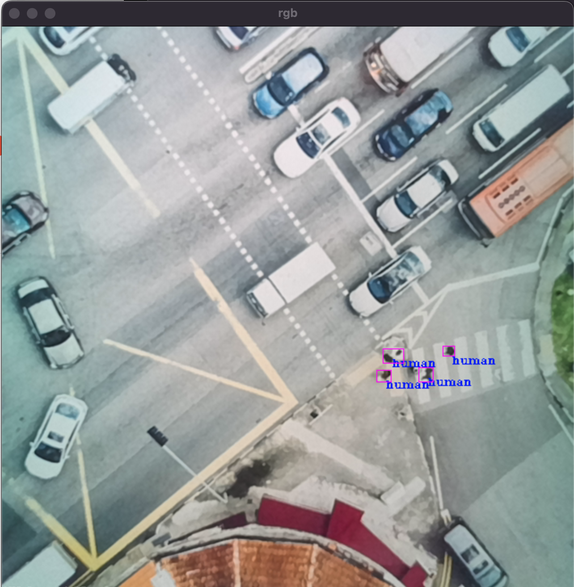
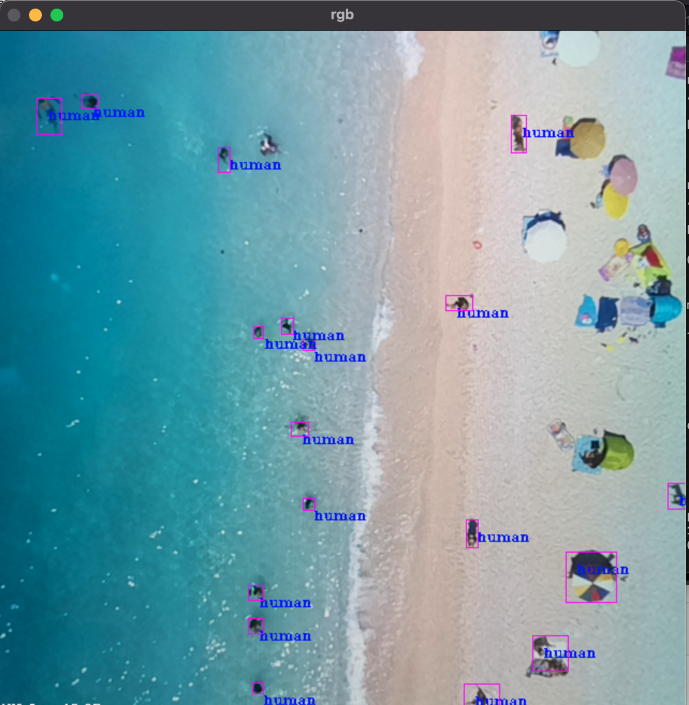
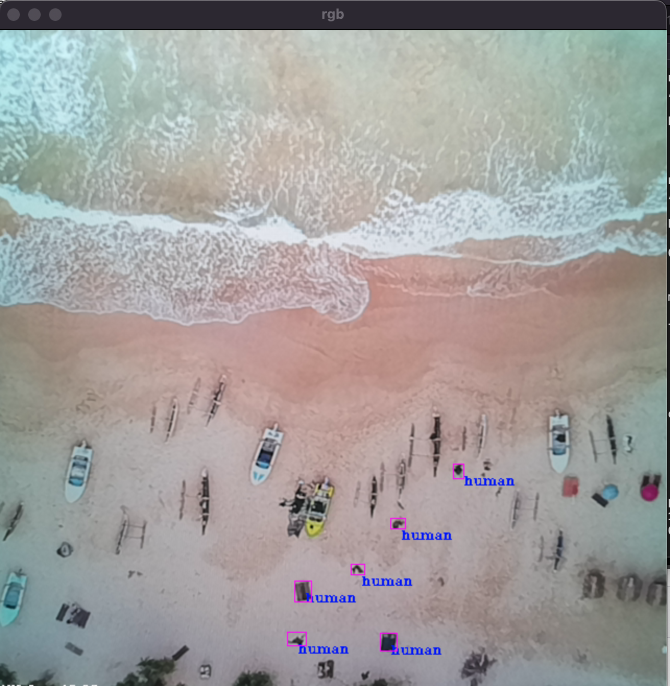
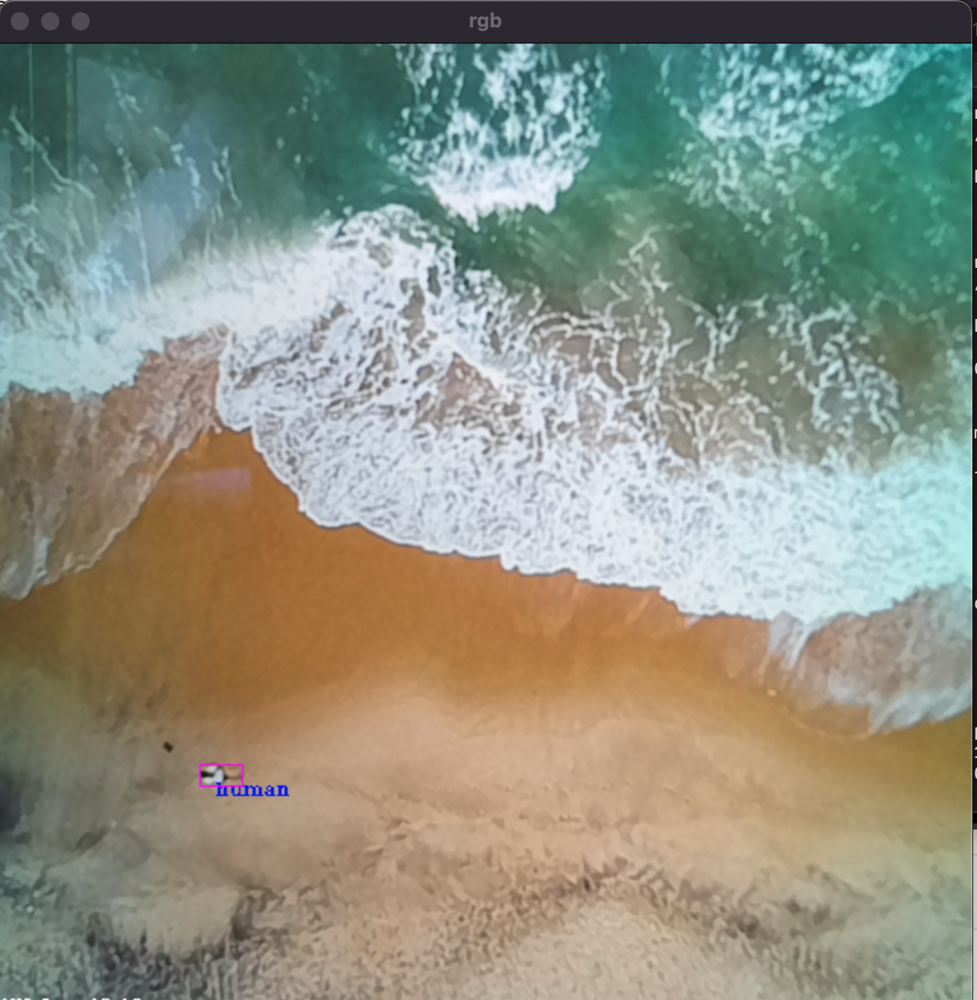
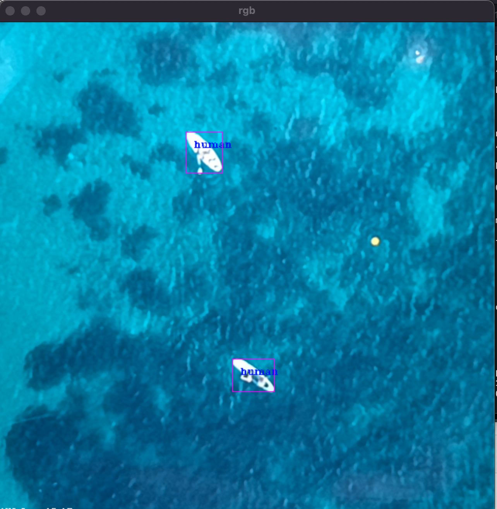
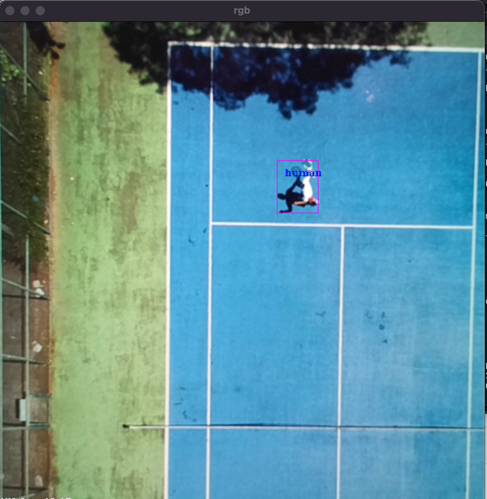
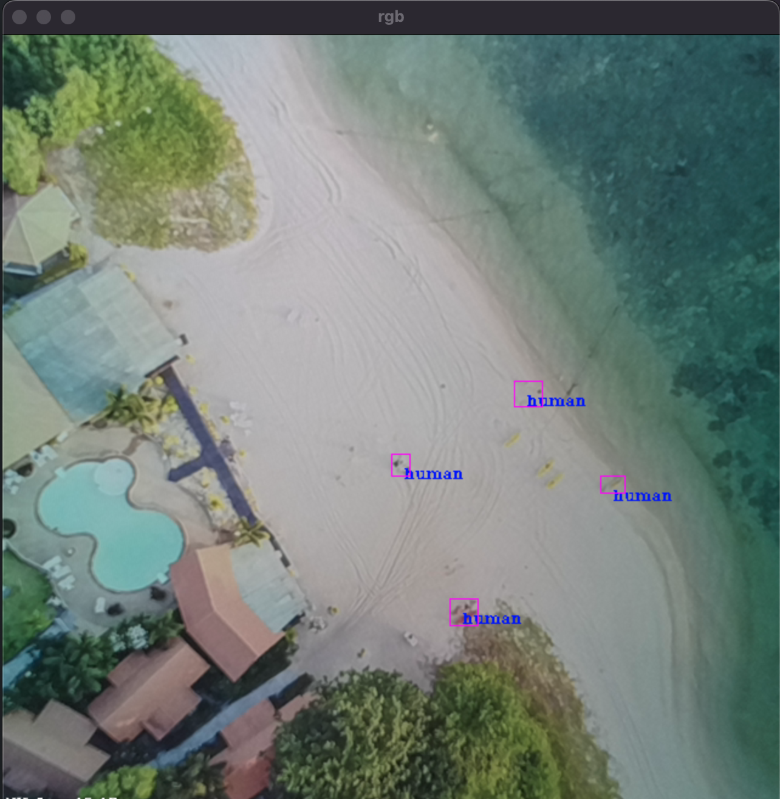

# WALDO
Whereabouts Ascertainment for Low-lying Detectable Objects (get it?) 

# What is this?

WALDO is a trained detection (bounding-box) deep neural network for UAV enabling the detection of land-based objects. The current alpha version detects only people for now. Next up will be cars, trees, buildings etc... Let me know what you'd like to detect!
If you need segmentation instead of detection make sure to check out OpenLander here: https://github.com/stephansturges/OpenLander/

# How can I use this?

You will need any Luxonis device with an RGB camera and the correct version of the depthai-python library installed for your platform and device combination. In terms of real-world use I would recommend that you get a device with a global shutter RGB camera with high light sensitivity and relatively low optical distortion.

# Practical device recommendations:

If you do not yet own an OAK-series camera from Luxonis and want one to use with this repository, your best bet is to get an OAK-1 device modified with an OV9782 sensor with the "standard FOV".
This is how to do it: 
1. Go to the OAK-1 on the Luxonis store and add it to your cart https://shop.luxonis.com/collections/usb/products/oak-1
2. Go the the "customization coupon" in the Luxonis store and add one of those https://shop.luxonis.com/collections/early-access/products/modification-cupon
3. In your shopping cart, add "please replace RGB sensor with standard FOV OV9782" in the "instructions to seller" box

... and then wait a week or so for your global-shutter, fixed-focus, high-sensitivity sensor to arrive :)

# Why? 

In the amateur and professional UAV space there is a need for simple and cheap tools that can be used to determine safe emergency landing spots, avoiding crashes and potential harm to people.

# How does it work?

The neural network is a YOLO-based single-shot-detector, trained on my own synthetic dataset!

# Update 2022 12 13

Alpha 0.3: introducing a new network which is based on a quantized / pruned / sparsified yoloV5 model which runs at 4-5 FPS on the embedded system. I'm also adding this model in ONNX format for use on other devices. General mAP is still quite low for most use cases, but it works great as-is for detecting individual people in sparse landscapes for use in SAR for example!

Check out a quick preview: 

https://www.loom.com/share/811239eb34104a23bbef03befadc9f85

# Update 2022 11 30

Alpha 0.2: introducing network / model *no3* which is a full-sized YOLOv7. This network performs an order of magnitude better in terms of accuracy and detection but also runs at <10% of the speed on an embedded camera from Luxonis.

# Update 2022 11 24

FIRST Release! This is super early days, and 99% of the code is directly just boilerplate from Luxonis. 
Just check out the video below to see what this repo does!

/!\ Don't take this as any indication of the DNN's real-world performance, as I mention in the video the test setup here is a mess... this is just to illustrate what this network does /!\

https://www.loom.com/share/681407a64be04d99ad1efc340c358f6a

NOTE: the default neural network is the one in /models/2/ , you can play with the one in /models/1/ if you'd like but that one as a failed experiment which will only work with higher altitude flight in the real world. 

# What about detection of X? Can you update the neural network?

There will be updates in the future, but I am also developing custom versions of the neural network for specific commercial use cases and I won't be adding everything to OpenLander. 
OpenLander will remain free to use and is destined to improving safety of UAVs for all who enjoy using them!

## pics

# Sources:
Some code taken from the excellent https://github.com/luxonis/depthai-experiments from Luxonis.

# Copyright is MIT license
Copyright Stephan Sturges 2022

Permission is hereby granted, free of charge, to any person obtaining a copy of this software and associated documentation files (the "Software"), to deal in the Software without restriction, including without limitation the rights to use, copy, modify, merge, publish, distribute, sublicense, and/or sell copies of the Software, and to permit persons to whom the Software is furnished to do so, subject to the following conditions:
The above copyright notice and this permission notice shall be included in all copies or substantial portions of the Software.
THE SOFTWARE IS PROVIDED "AS IS", WITHOUT WARRANTY OF ANY KIND, EXPRESS OR IMPLIED, INCLUDING BUT NOT LIMITED TO THE WARRANTIES OF MERCHANTABILITY, FITNESS FOR A PARTICULAR PURPOSE AND NONINFRINGEMENT. IN NO EVENT SHALL THE AUTHORS OR COPYRIGHT HOLDERS BE LIABLE FOR ANY CLAIM, DAMAGES OR OTHER LIABILITY, WHETHER IN AN ACTION OF CONTRACT, TORT OR OTHERWISE, ARISING FROM, OUT OF OR IN CONNECTION WITH THE SOFTWARE OR THE USE OR OTHER DEALINGS IN THE SOFTWARE.
